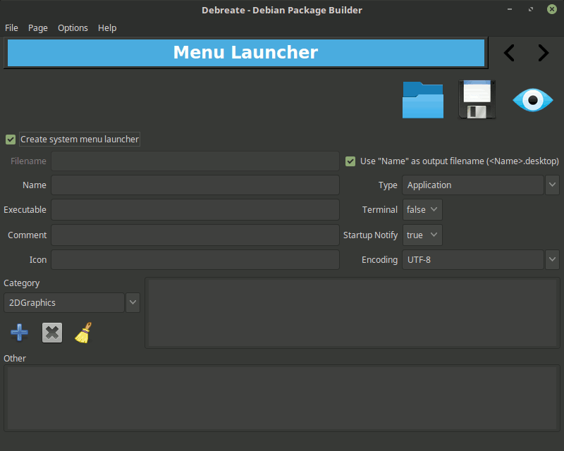
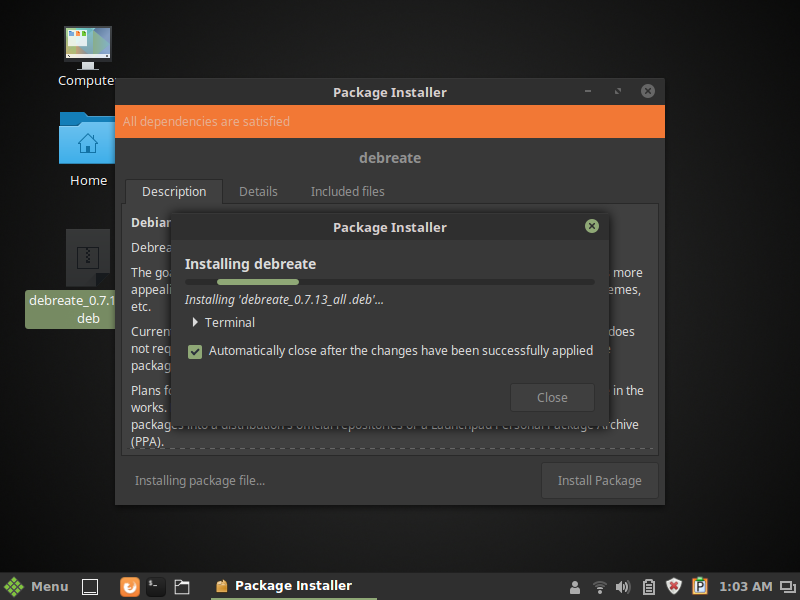

![][icon]

## Debreate - Debian Package Builder

### Table of Contents
* [Description](#description)
* [Dependencies](#dependencies)
* [Installation](#installation)
* [Standalone Use](#standalone-use)
* [Links](#links)
* [Other Pages](#other-pages)

### [Description](#table-of-contents)

Debreate is a utility to aid in creating [Debian (.deb)][wiki.deb] packages. Currently it only supports binary packaging which allows packaging of pre-compiled or scripted applications, media, artwork, etc. for personal distribution. Plans for using backends such as [dh_make][pkg.dh-make] & debuild (available in [devscripts][pkg.devscripts] package) for creating source packages are in the works. But source packaging can be quite different & is a must if you want to get your packages into a distribution's official repositories or a [Launchpad][launchpad] [Personal Package Archive (PPA)][wiki.ppa]. The latter from which [Debreate has recently become available][ppa.debreate].

The definition of Debian source packages may be a little confusing (as it was for me) for those that are new to the Debian format, or perhaps packaging in general. Debian source packages are essentially no different than common tarballed source archives & they can be available in many of the popular formats such as Gzip (.tar.gz), BZip2 (.tar.bz2), XZ (tar.xz), Lzip (tar.lzip), etc. To build Debian binary packages from source code, it must first be "debianized". Debianization involves creating a directory called 'debian' within the source root folder. Files with instructions, meta data, & more are placed within to instruct Debian tools, such as *debuild*, on how the source must be compiled & packaged into the final .deb. This is the process that must be taken to host software on repositories such as Lauchpad's PPA system. The debianized source is uploaded, then built & packaged on-site automatically. The resulting binary package (.deb) is published to the target PPA.

### [Dependencies](#table-of-contents)

Debreate needs these packages installed to run:
* [python][pkg.python] (version 2.7 is supported)
    * The goal is to eventually port to Python 3.
        * Currently, wxPython only supports up to version 2.7.
* [python-wxgtk3][pkg.python-wxgtk3] or [python-wxgtk2.8][pkg.python-wxgtk2.8] (wxPython)
* [python-wxversion][pkg.python-wxversion]
* [dpkg][pkg.dpkg]
    * If you are running a Debian/Ubuntu based system, then this is most likely already installed.
* [fakeroot][pkg.fakeroot]
* [coreutils][pkg.coreutils]

These packages are recommended & enable some features:
* [lintian][pkg.lintian]

### [Installation](#table-of-contents)

Download deb file from [Gemfury project page](https://gemfury.com/beebox/deb:debreate), and use gdebi to install.

#### Generating the Makefile

A 'setup.py' script is used to generate the Makefile (this is not the same type of 'setup.py' that is used with [distutils][]). A python interpreter must be installed to run the script. From a terminal execute ***./setup.py*** from the source root dirctory then follow the prompts. If you want to bypass prompting & use the default settings execute ***./setup.py defaults***. The Makefile will be generated in the same directory.

#### Using the Makefile

Open a terminal in the root directory & execute ***make install***. To create a distribution package execute ***make dist***. To uninstall execute ***make uninstall***. For help & more options use ***make help***.

If you have [debuild][pkg.devscripts] installed, you can execute ***make deb-bin*** from the command line to build the debian package (.deb).

It is recommended to build the .deb package with ***make deb-bin*** & install via the system's package manager.

### [Standalone Use](#table-of-contents)

To run, launch the file named "init.py":
* ***./init.py*** or ***python init.py*** (NOTE: Python 3.x is currently not supported)

### [Links](#table-of-contents)
* [GitHub macrolinux](https://github.com/macrolinux/debreate)
* [Gemfury project page](https://gemfury.com/beebox/deb:debreate)

[icon]: bitmaps/debreate64.png

[launchpad]: https://launchpad.net/
[wxpython]: https://wxpython.org/

[wiki.deb]: https://en.wikipedia.org/wiki/Deb_(file_format)
[wiki.makefile]: https://en.wikipedia.org/wiki/Makefile
[wiki.ppa]: https://en.wikipedia.org/wiki/Personal_Package_Archive
[wiki.superuser]: https://en.wikipedia.org/wiki/Superuser

[src.debreate-unstable]: https://github.com/AntumDeluge/debreate/tree/unstable

[ppa.debreate]: https://launchpad.net/~antumdeluge/+archive/ubuntu/debreate
[ppa.debreate-dev]: https://launchpad.net/~antumdeluge/+archive/ubuntu/debreate-dev

[pkg.coreutils]: http://packages.ubuntu.com/coreutils
[pkg.devscripts]: http://packages.ubuntu.com/devscripts
[pkg.dh-make]: http://packages.ubuntu.com/dh-make
[pkg.dpkg]: http://packages.ubuntu.com/dpkg
[pkg.fakeroot]: http://packages.ubuntu.com/fakeroot
[pkg.gdebi]: http://packages.ubuntu.com/gdebi
[pkg.gvfs-bin]: http://packages.ubuntu.com/gvfs-bin
[pkg.lintian]: http://packages.ubuntu.com/lintian
[pkg.python]: http://packages.ubuntu.com/python2.7
[pkg.python-wxversion]: http://packages.ubuntu.com/python-wxversion
[pkg.python-wxgtk2.8]: http://packages.ubuntu.com/python-wxgtk2.8
[pkg.python-wxgtk3]: http://packages.ubuntu.com/python-wxgtk3

[ubu.wily.python-wxgtk]: http://packages.ubuntu.com/wily/python-wxgtk2.8

[cmake]: https://cmake.org/
[distutils]: https://wiki.python.org/moin/Distutils
[gnu-autotools]: https://en.wikipedia.org/wiki/GNU_Build_System
